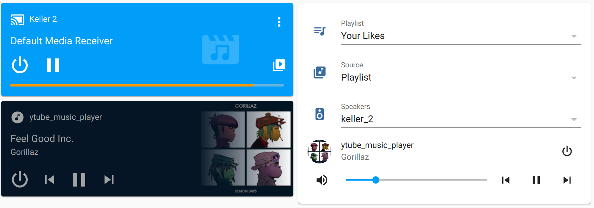
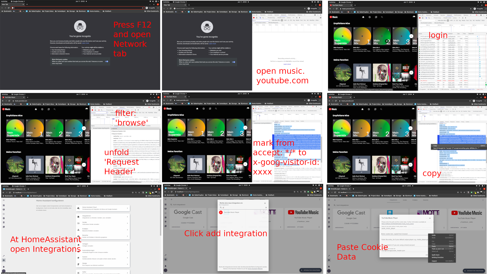

# yTube Music Player
[](https://github.com/custom-components/hacs)

Adds a mediaplayer to Home Assistant that can stream tracks from your YouTube music premium subscription to a media player.


With mini-media-player (https://github.com/kalkih/mini-media-player) and shortcuts


Or nativ in Homeassistant with dropdowns

Also supports media_browser


## Features
- Browse through all you library tracks / artists / playlists
- Either plays straight from the playlist or creates a radio based on the playlist
- Forwards the streaming data to any generic mediaplayer
- Keeps auto_playing as long as it is turned on
- On the fly change of media_player (playlist will stay the same, and position in track will be submitted to next player)
- Some proxy funcationality to support sonos player (currently testing_state)

# Support
If you like what I've done and you want to help: buy me a coffee/beer. Thanks! 

[](https://www.buymeacoffee.com/KoljaWindeler)


# Installation

**This component will set up the following platforms.**

Platform | Description
-- | --
`media_player` | will allow to play music from your YouTube Music account

## HACS

The easiest way to add this to your Home Assistant installation is using [HACS](https://hacs.xyz/docs/basic/getting_started).

# Setup

You need to grab and convert a cookie from youTube Music. This is described in https://ytmusicapi.readthedocs.io/en/latest/setup.html#copy-authentication-headers and also below.



**1. Basic steps for grabbing**

1. Open the development tools (I've used google chrome) [Crtl+Shift+I / F12]
2. Open the Network tab
3. Open https://music.youtube.com, log out, log in, browse a bit around like clicking on the library in the top menu
4. Search for "browse" (for me only one item shows up)
5. Go to "headers" -> "request headers" 
6. copy everything starting after the "accept: */*" (mark with a mouse and copy to clipboard)

**2. Please use the config flow of Home Assistant**

7. Open Configuration -> Integrations -> "add integration" -> "YouTube Music Player"
   1. If the integration didn't show up in the list please REFRESH the page
9. Paste the cookie into the indicated field, all other fields are optional or provide default values 
   1. It is highly recommended to enter the entity_id of your default output player, otherwise you have to set that after every reboot
   2. The second page shows several entity_ids for dropdown field. You can leave the default values, even if you don't want to use those field and don't add them to your configuration... or clear the field ... both will work fine (see [below](https://github.com/KoljaWindeler/ytube_music_player#dropdowns-buttons-and-marksdowns))

**Although YAML configuration is still possible: Please remove it and configure the player via config_flow or several functions will be missing**

## Shortcuts
The screenshot below shows the mini-media-player from kalkih (https://github.com/kalkih/mini-media-player)


This mediaplayer offers shotcuts, which can be used to select a remote_player and playlist with a single click:

```
- type: 'custom:mini-media-player'
  entity: media_player.ytube_music_player
  artwork: cover
  hide:
    shuffle: false
    icon_state: false
  shortcuts:
    columns: 3
    buttons:
      - name: Badezimmer
        type: source
        id: badezimmer
      - name: Keller
        type: source
        id: keller
      - name: Laptop
        type: source
        id: bm_8e5f874f_8dfcb60f
      - name: My Likes
        type: channel
        id: PLZvjm51R8SGuxxxxxxx-A17Kp3jZfg6pg
      - name: Lala
        type: playlist
        id: PLZvjm51R8SGuxxxxxxx-A17Kp3jZfg6pg
```

## Services
The following commands are available:
mini-media-player shortcut type | service call | details
-- | -- | --
`source` | **media_player.select_source** *source=id and entity_id=[this]* | selects the media_player that plays the music. id can be an entity_id like `media_player.speaker123` or just the name `speaker123`
`playlist` | media_player.play_media | plays a playlist from YouTube. *You can get the playlist Id from the Youtube Music website. Open a playlist from the library and copy the id from the link e.g. https://music.youtube.com/playlist?list=PL6H6TfFpYvpersxxxxxxxxxaPueTqieF*
`channel` | media_player.play_media | selects one track from a **playlist** and starts a radio based on that track. So the id has to be a **playlist_id**
`album` | media_player.play_media | plays an album. *You can  get the album Id from the Youtube Music website. Open an album from the library https://music.youtube.com/library/albums and copy the Id from the links*
`track` | media_player.play_media | will play only one dedicated track
`history` | media_player.play_media | will play a playlist from your recent listen music **on the website or the app** *the music that you play with this component will not show up in the list*
`user_tracks` | media_player.play_media | this type will play the **uploaded** tracks of a user
`user_album` | media_player.play_media | **uploaded** album of a user
`user_artist` | media_player.play_media | play all **uploaded** tracks of an artists

All calls to *media_player.play_media* need three arguments: media_content_id is the equivalent of the shortcut id, media_content_type represents the type (e.g. album) and the entity_id is always media_player.ytube_music_player

You can also select the music you want to listen to via the media_browser and look up the media_content_type and media_content_id in the attributs of the player.

In addition the following special commands are also available:
Service | parameter | details
-- | -- | --
`ytube_music_player.call_method` | `entity_id`: media_player.ytube_media_player, `command`: rate_track, `parameters`: thumb_up / thumb_down / thumb_middle / thumb_toggle_up_middle | Rates the currently playing song. The current rating is available as 'likeStatus' attribute of the player entity_id. middle means that the rating will be 'indifferent' so basically removes your previous rating
`ytube_music_player.call_method` | `entity_id`: media_player.ytube_media_player, `command`: reload_dropdowns | Reloads the dropdown list of all media_players and also the playlists. Might be nice to reload those lists without reboot HA
`ytube_music_player.call_method` | `entity_id`: media_player.ytube_media_player, `command`: interrupt_start | Special animal 1/2: This will stop the current track, but note the position in the track. It will also store the track number in the playlist and the playlist. Finally it will UNTRACK the media_player. As result you can e.g. play another sound on that player, like a door bell or a warning
`ytube_music_player.call_method` | `entity_id`: media_player.ytube_media_player, `command`: interrupt_resume | Special animal 2/2: This is the 2nd part and will resume the playback

## Dropdowns, Buttons and Marksdowns
The player can controlled with shortcut from the mini-media-player, with direct calls to the offered services or simply by turing the player on.
However certain extra informations are required to controll what will be played and where to support the "one-click-turn-on" mode. These are presented in the form of drop-down fields, as shown in the screenshot below. The dropdowns can be copied from the yaml at package/markdown.yaml. *You can also rename those dropdowns if you have to (e.g. if you run two players). Go to the 'options' dialog (configflow) and change the default values during the second step to update the ytube_media_player if you do that.*

The player attributes contain addition informations, like the playlist and if available the lyrics of the track

The yaml setup is available at package/markdown.yaml

## Automations
Play my **favorite** playlist in **random** mode on my **kitchen** speaker (kuche)
```yaml
alias: ytube morning routine
sequence:
  - service: media_player.select_source
    data:
      source: kuche
      entity_id: media_player.ytube_music_player
  - service: media_player.shuffle_set
    data:
      shuffle: true
      entity_id: media_player.ytube_music_player
  - service: media_player.play_media
    data:
      entity_id: media_player.ytube_music_player
      media_content_id: PL6H6TfFpYvpersEdHECeWkocaPueTqieF
      media_content_type: playlist
mode: single
```
Interrupt current playback, play a "DingDong" and resume playback
```yaml
alias: dingdong
sequence:
  - service: ytube_music_player.call_method
    entity_id: media_player.ytube_music_player
    data:
      command: interrupt_start
  - variables:
      vol: '{{ state_attr("media_player.keller_2", "volume_level") }}'
  - service: media_player.volume_set
    entity_id: media_player.keller_2
    data:
      volume_level: 1
  - service: media_player.play_media
    entity_id: media_player.keller_2
    data:
      media_content_id: 'http://192.168.2.84:8123/local/dingdong.mp3'
      media_content_type: music
  - delay: '00:00:02'
  - service: media_player.volume_set
    entity_id: media_player.keller_2
    data:
      volume_level: 0
  - service: ytube_music_player.call_method
    entity_id: media_player.ytube_music_player
    data:
      command: interrupt_resume
  - service: media_player.volume_set
    entity_id: media_player.keller_2
    data:
      volume_level: '{{vol}}'
mode: single

```

## Sonos support / Proxy

Playback on Sonos speakers has several issues. Just forwarding the stream to the media_player returns a "mime-type unknown" error. 
I've done some testing on a Sonos Speaker of a friend and found that it is possible to download the current track and serve it from the webserver that homeassistant offers.
This feature can be activated by providing two settings:
1) `proxy_path` | This is the local folder, that the component is using to STORE the file. 
The easiest way it to provide your www folder. Be aware: If you're using a docker image (or HassOS) that the component looks from INSIDE the image.
So for most users the path will be `/config/www`
2) `proxy_url` | The path will be send to your Sonos speaker. So typically this should be something like `http://192.168.1.xxx:8123/local`. Please note that https will only work if you have a valid ssl-certificat, otherwise the Sonos will not connect. 

You can also use a dedicated server, if you don't want to use homeassistant as http server, or you have some special SSL setup.
If you're running docker anyway you could try `docker run --restart=always --name nginx-ytube-proxy -p 8080:80 -v /config/www:/usr/share/nginx/html:ro -d nginx`
This will spin up server on port 8080 that serves `/config/www` so your `proxy_url` would have to be `http://192.168.1.xxx:8080`.

You can use this also with other speakers, but it will in general add some lack as the component has to download the track before it will start the playback. So if you don't need it: don't use it. If you have further question or if this is working for you please provide some feedback at https://github.com/KoljaWindeler/ytube_music_player/issues/38 as I can't test this on my own easily. Thanks!

## MPD fix

The mpd media_player will transition to `off` instead of `idle` at the end of each track. Ytube_music_player is able to handle this.
Please add this automation from **@lightzhuk** to your configuration:
```yaml
- alias: mpd_fix
  initial_state: true
  trigger:
    - platform: homeassistant
      event: start
  action:
    - delay: 00:00:12
    - service: ytube_music_player.call_method
      entity_id: media_player.ytube_music_player
      data:
        command: off_is_idle
```

## Debug Information
I've added extensive debugging information to the component. So if you hit an error, please see if you can get as many details as possible for the issue by enabling the debug-log-level for the component. This will produce quite a lot extra informations in the log (configuration -> logs). Please keep in mind that a restart of Homeassistant is needed to apply this change. 
```yaml
logger:
  default: info
  logs:
    custom_components.ytube_music_player: debug
```


## Multiple accounts
Not yet tested, but should work in general. Please create two entities via the Config_flow and use **different** paths for the header file

## Credits

This is based on the gmusic mediaplayer of tprelog (https://github.com/tprelog/HomeAssistant-gmusic_player), ytmusicapi (https://github.com/sigma67/ytmusicapi) and pytube (https://github.com/nficano/pytube). This project is not supported nor endorsed by Google. Its aim is not the abuse of the service but the one to improve the access to it. The maintainers are not responsible for misuse.
